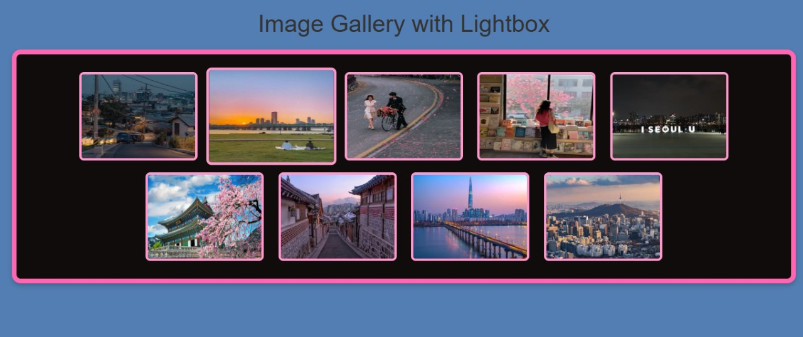

# Image Gallery with Lightbox

## Description
A stylish image gallery where users can click an image to view it in a full-screen lightbox.

## Tech Used
- HTML for structure
- CSS for styling
- Bootstrap grid for layout
- jQueryfor lightbox functionality

## Features
- Thumbnail Grid: Displays images in a structured grid layout.
- Click-to-Expand: Users can click on an image to enlarge it in a lightbox.
- Next/Previous Navigation: Lightbox allows users to navigate between images smoothly.
- Attractive Border & Styling: The gallery is designed with an eye-catching border frame and hover effects.

## How to Use
1. Clone this repository.
2. Ensure all images are placed in the `images/` folder with the correct names (`img1.jpg`, `img2.jpg`, ..., `img9.jpg`).
3. Open `index.html` in a browser or run a Live Server in VS Code.

## Preview
The gallery includes 9 aesthetic images of South Korea, presented in a beautiful grid layout.

## Dependencies
- [Bootstrap 5](https://getbootstrap.com/)
- [jQuery 3.6](https://jquery.com/)

## 📸 Screenshot 
(screenshot4.jpg)

## 📩 Contact
reach out to me at [vidhi.23bce11014@vitbhopal.ac.in].